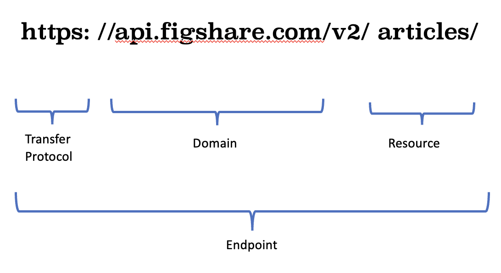
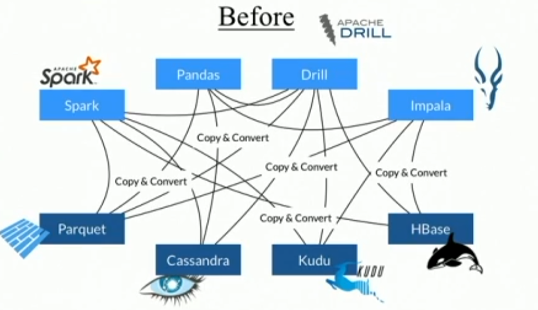
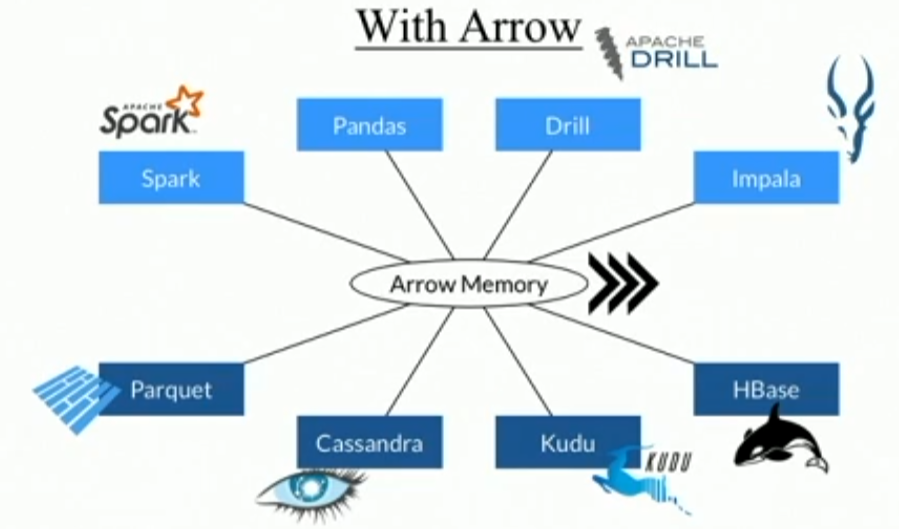

# Cloud Computing

## Data Management in Big Data Environment

### Getting Data

| **WHERE to get data?** | **HOW to get data?**              |
| ---------------------- | --------------------------------- |
| Collect from people    | Just ask them                     |
| From databases         | SQL queries                       |
| From computer/ servers | By just logging in or downloading |
| From websites          | Using Web scraping or API         |

### Data from Websites

- Use APIs (Application Program Interface)
  - Acts as a messenger for communication between softwares, websites, servers, etc
- Use a protocol like **HTTP(s)** or **RPC** (Remote Procedure Call)
  - **HTTP(s)**: HyperText Transfer Protocol
  - **RPC**: Remote Procedure Call
- Convention: **RESTful API**
  - Uses HTTP requests to GET, PUT, POST, DELETE data
  - Uses JSON or XML for data exchange


- We do not have access to the server (i.e. cannot SSH into it)
- BUT there are certain **endpoints** that the providers have made available for us to access the data.

  - request on the endpoint via HTTP methods
  - Endpoints are like URLs:
    

**_- Using rest API_**

Go lower level to get direct access to the data. Many website providers give this option; here are a few examples;

- [Twitter API](https://developer.twitter.com/en/docs/twitter-api)
- [Facebook API](https://developers.facebook.com/docs/pages/)
- [Pinterest API](https://developers.pinterest.com/docs/redoc/)
- [Figshare API](https://help.figshare.com/article/how-to-use-the-figshare-api)

Here are some packages that you can use to interact with these API's

- [requests](https://docs.python-requests.org/en/latest/) (Python)
- [httr](https://cran.r-project.org/web/packages/httr/vignettes/quickstart.html) (R )

**_- Web Scraping_**

Here are some packages that you can use to interact with these API's

- [BeautifulSoup](https://beautiful-soup-4.readthedocs.io/en/latest/) (Python)
- [scrapy](https://scrapy.org) (python)
- [rvest](https://www.rstudio.com/blog/rvest-easy-web-scraping-with-r/) ( R )

## Big Data

- Definition: Data with size larger than your computer's capacity to handle (RAM, CPU, etc.)
  - Storage is very cheap so its the smallest problem

### 3 V's of Big Data

1. **Volume**: Size of data
   - Solutions:
     - Cloud storage
     - Partitioning/ Sharding
     - Parallel processing
2. **Velocity**: Speed at which data is generated
   - Solutions:
     - BASE databases
     -
3. **Variety**: Alignment of data fields from different sources

## Working with Big Data Locally

### Terminology

- **Human readable**: Data that can be read by humans
- **Schema**: Structure of data
  - CSV, JSON do not have a schema
- **Partitioning**: Splitting data into smaller chunks
- **Sharding**: Splitting data into smaller chunks and distributing them across different servers

| OLTP (Online Transaction Processing) | OLAP (Online Analytical Processing)   |
| ------------------------------------ | ------------------------------------- |
| Row-based storage                    | Columnar storage                      |
| Good for transactions (row by row)   | Good for analytics (column by column) |
| Common in relational databases       | Common in big data environments       |
| MySQL, PostgreSQL                    | Redshift, BigQuery, Snowflake         |

### Parquet

- Was initially designed for Hadoop by Twitter and Cloudera
- Considered as _de facto_ standard for big data storage
- Other file formats for big data: Avro, ORC

#### Properties

- Binary file format (not human readable)
  - Compressed and encoded
  - Very small and highly efficient
  - Can turn 30GB of CSV into 5GB of Parquet
- Columnar storage
- Open source
- Language agnostic
- `Projection Pushdown`: Only put needed columns in memory
- `Predicate Pushdown`: Only put needed rows in memory
- `Schema Evolution`: Can handle changes in schema
- Partitioning: Stores and processes data in chunks (more efficient)

#### CSV to Parquet

```python
%load_ext rpy2.ipython
```

```python
import pyarrow.dataset as ds

file_path_csv = "data.csv"
file_path_parquet = "data.parquet"

df = ds.dataset(file_path, format="csv")
ds.write_dataset(df, file_path_parquet,
  format="parquet",
  existing_data_behavior = 'overwrite_or_ignore')
```

- Read the same file in R in jupyter notebook

```python
%%R -i file_path_parquet

dataset <- open_dataset(file_path_parquet)
# dataset is not a dataframe yet
result_query <- dataset |> filter(year == 2004)
# result_query is still not processed
# lazy evaluation
result <- collect(result_query)
# result is now a dataframe
```

### Apache Arrow

- Cross-language development platform for in-memory data. Here are certain properties of arrow:
  - Whenever possible, it will read and process data in chunks and in parallel (default behavior, so you don’t want to worry about manually doing it)
  - Columnar Memory Format
  - Language-independent
  - Zero-copy Reads
  - Minimum Serialization




```python
import pyarrow as pa
import rpy2_arrow.pyarrow_rarrow as pyra

dataset = ds.dataset(file_path_csv, format="csv")
table = dataset.to_table()
r_table = pyra.converter.py2rpy(table)
```

```python
%%R -i r_table
# r_table is now a dataframe
result <- r_table |> count(UniqueCarrier)
```
